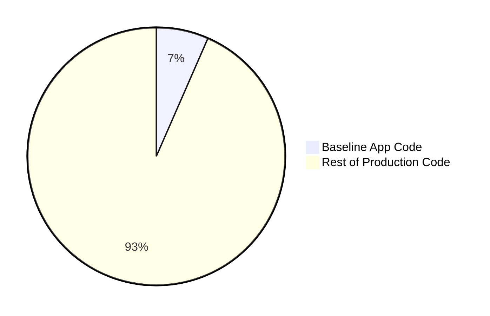

# go-to-production: A Cloud-Native Journey

> **Note:** This is a "minimum viable system (more than one component)" application. The code itself (a simple To-Do list) is intentionally basic. The real value of this repository is the **infrastructure, security, and observability** wrapper around it. It demonstrates how to take a simple app and make it production-ready on Google Cloud.

## Purpose

This repository serves as a reference implementation for modern cloud-native practices on Google Cloud Platform (GCP). It evolves from a simple local Docker setup to a highly available, secure, and observable system running on GKE.

### Evolution Overview

The repository has grown from a simple local Docker setup to a comprehensive cloud-native reference implementation.

- **Baseline Tag**: The starting point (simple Go app + Docker Compose).
- **Main Branch**: The finished state (GKE, Cloud SQL, Cloud Deploy, Observability).

### Key Insights

1.  **Documentation First**: The largest growth area was **Documentation (+695%)**. This reflects the educational nature of the project, with detailed guides for every milestone.
2.  **Infrastructure Complexity**: **IaC grew by 25x** (64 to 1,714 lines). This illustrates the reality of cloud-native engineering: the application code is often the tip of the iceberg compared to the infrastructure code required to run it reliably.
3.  **Application Maturity**: The application code doubled in size (+114%) to support production features like:
    *   Prometheus instrumentation
    *   Structured logging
    *   Cloud Trace integration
    *   Robustness patterns (retries, circuit breakers)
    *   Security headers (CSP)

### Visualization


The chart above visualizes the step-by-step growth of the repository. You can see the "Infrastructure" (green) and "Documentation" (orange) layers expanding with each milestone, while the "Application Code" (blue) grows more gradually as we add features like metrics and tracing.

### Conclusion

Transforming a "minimum viable system (more than one component)" into a production-ready system requires a significant investment in infrastructure and documentation. In this project, for every line of application code, we wrote approximately **2 lines of Infrastructure as Code** and **3.5 lines of Documentation**.

### Code Size Distribution: Baseline App Code vs. Rest of Production



**Key Concepts Demonstrated:**
*   **Infrastructure as Code**: Terraform for GKE, Cloud SQL, and IAM.
*   **CI/CD**: GitHub Actions + Google Cloud Deploy for automated canary releases.
*   **Security**: Workload Identity, Secret Manager, Cloud Armor WAF, and IAM Auth.
*   **Observability**: Prometheus metrics, Cloud Trace, and SLO monitoring.
*   **Robustness**: Circuit breakers, retries, and regional high availability.

## Navigating the Journey

This repository uses **Git Tags** to mark specific points in the productionization journey. You can check out any tag to see the code exactly as it was at that stage.

**How to use tags:**

1.  **List all tags:**
    ```bash
    git tag -l
    ```
2.  **Checkout a specific milestone:**
    ```bash
    git checkout tags/milestone-base-infra
    ```
3.  **Return to the latest version:**
    ```bash
    git checkout main
    ```


---

## Baseline Application

If you want to run the simple, local version of the app (without any cloud dependencies), please refer to **[Milestone 0: Baseline Application](docs/00_BASELINE.md)**.

The `main` branch contains cloud-specific code that will not run locally without GCP credentials.

## Technologies Used

*   **Backend**: Go
*   **Database**: PostgreSQL (Cloud SQL with HA + Read Replica)
*   **Containerization**: Docker, Docker Compose
*   **Frontend**: HTML, CSS, JavaScript (served statically)
*   **Cloud**: Google Cloud Platform (GKE, Cloud SQL, Artifact Registry, Cloud Deploy)
*   **Authentication**: Workload Identity, Cloud SQL IAM Authentication
*   **Robustness**: cenkalti/backoff, sony/gobreaker
*   **Observability**: Prometheus, Cloud Monitoring

## Milestones

Each milestone represents a specific tag in the git history. You can checkout these tags to see the code at that stage.

| Milestone | Tag | Description |
| :--- | :--- | :--- |
| **0. Baseline** | `baseline` | Simple Go app + Docker Compose. [Docs](docs/00_BASELINE.md) |
| **1. Risk Analysis** | `milestone-risk-analysis` | Risk mitigation & implementation plans. [Docs](docs/01_RISK_ANALYSIS.md) |
| **2. Base Infra** | `milestone-base-infra` | GKE, Cloud SQL, CI/CD pipeline. [Docs](docs/02_BASE_INFRASTRUCTURE.md) |
| **3. HA & Scale** | `milestone-ha-scale` | Regional GKE, HA Cloud SQL, HPA. [Docs](docs/03_HA_SCALABILITY.md) |
| **4. IAM Auth** | `milestone-iam-auth` | Workload Identity, Cloud SQL IAM Auth. [Docs](docs/04_IAM_AUTH_AND_SECRETS.md) |
| **5. Security** | `milestone-security-hardening` | Cloud Armor WAF, HTTPS, CSP. [Docs](docs/05_SECURITY_HARDENING.md) |
| **6. Advanced Deploy** | `milestone-advanced-deployment` | Cloud Deploy, Canary releases. [Docs](docs/06_ADVANCED_DEPLOYMENT.md) |
| **7. Observability & Robustness** | `milestone-observability-metrics`, `milestone-resilience-slos` | Prometheus, PITR, Circuit breakers, SLOs. [Docs](docs/07_OBSERVABILITY_METRICS.md), [Docs](docs/08_ROBUSTNESS_SLOS.md) |
| **8. Tracing** | `milestone-tracing-polish` | Cloud Trace integration. [Docs](docs/09_TRACING_AND_POLISH.md) |

See **[Milestone 0: Baseline Application](docs/00_BASELINE.md)** for instructions on running the local development version.

See **[Runbook](docs/RUNBOOK.md)** for operational procedures.

## Reliability & Security Plan

### Risk Matrix

#### Infrastructure & Reliability Risks
| Risk Category | Specific Risk | Prob (1-3) | Imp (1-4) | Score | Status | Existing Mitigation | Proposed Mitigation |
| :--- | :--- | :--- | :--- | :--- | :--- | :--- | :--- |
| **Self-Imposed** | Bad Deployment | High (3) | High (3) | **9** | ✅ | Canary (Cloud Deploy) | **Automated Rollback on SLO Breach** |
| **Self-Imposed** | Manual Config Drift | High (3) | Med (2) | **6** | ❌ | *None* | **GitOps (ArgoCD) + Policy as Code** |
| **Infra Failure** | Single Zone Failure | Med (2) | High (3) | **6** | ✅ | Regional GKE, HA Cloud SQL | **N/A (Already Mitigated)** |
| **Infra Failure** | Quota Exhaustion | Med (2) | High (3) | **6** | ❌ | *None* | **Quota Monitoring & Alerts** |
| **Self-Imposed** | Terraform State Conflict | Med (2) | Med (2) | **4** | ✅ | GCS Backend | **State Locking / Atlantis** |
| **Infra Failure** | Region Failure | Low (1) | Catastrophic (4) | **4** | ❌ | *None* | **Multi-Region Deployment** |
| **Infra Failure** | Billing Spike | Low (1) | High (3) | **3** | ❌ | *None* | **Budget Alerts + Cap Enforcement** |
| **Infra Failure** | Cloud Provider Failure | V.Low (0.5) | Catastrophic (4) | **2** | ❌ | *None* | **Multi-Cloud Strategy** |

#### Security & Attack Risks
| Risk Category | Specific Risk | Prob (1-3) | Imp (1-4) | Score | Status | Existing Mitigation | Proposed Mitigation |
| :--- | :--- | :--- | :--- | :--- | :--- | :--- | :--- |
| **Attack** | DDoS / Web Attacks | Med (2) | High (3) | **6** | ✅ | Cloud Armor | **Strict WAF Rules + Rate Limiting** |
| **Attack** | Dependency Vulnerabilities | Med (2) | High (3) | **6** | ❌ | *None* | **Dependabot + SCA Scanning** |
| **Attack** | Secrets Leakage (Git) | Med (2) | High (3) | **6** | ❌ | *None* | **Pre-commit hooks + Secret Scanning** |
| **Attack** | Insider Threat | Low (1) | Catastrophic (4) | **4** | ❌ | *None* | **Just-in-Time Access (JIT) + Audit Logs** |
| **Attack** | Supply Chain Attack | Low (1) | High (3) | **3** | ❌ | *None* | **Container Scanning + SBOM** |
| **Attack** | SQL Injection | Low (1) | High (3) | **3** | ✅ | Parameterized Queries | **N/A (Already Mitigated)** |

#### Data Integrity & Availability Risks
| Risk Category | Specific Risk | Prob (1-3) | Imp (1-4) | Score | Status | Existing Mitigation | Proposed Mitigation |
| :--- | :--- | :--- | :--- | :--- | :--- | :--- | :--- |
| **Data** | Sensitive Data Leakage | Med (2) | High (3) | **6** | ❌ | *None* | **Structured Logging + Redaction** |
| **Data** | Accidental DB Deletion | Low (1) | Catastrophic (4) | **4** | ✅ | PITR (Point-in-Time Recovery) | **Object Locks / Delete Protection** |
| **Data** | Backup Restore Failure | Low (1) | Catastrophic (4) | **4** | ❌ | *None* | **Automated Restore Drills** |
| **Data** | Ransomware / Corruption | Low (1) | High (3) | **3** | ❌ | *None* | **GCS Bucket Lock (Retention Policy)** |

### Detailed Mitigation Plan

#### 1. Reduce Blast Radius of Self-Imposed Changes
**Goal**: Prevent "fat finger" errors and ensure infrastructure matches code.

*   **GitOps (ArgoCD)**: Move from push-based (Cloud Deploy) to pull-based (ArgoCD). This ensures the cluster state always matches git. Any manual change is immediately reverted by the controller.
*   **Policy as Code (OPA/Gatekeeper)**: Enforce rules like "No public LoadBalancers" or "Must have resource limits" before deployment.
*   **Automated Rollback**: Hook up Cloud Monitoring alerts (SLO Burn Rate) to Cloud Deploy to trigger an automatic rollback if error budget burns too fast.

#### 2. Mitigate Infrastructure Failures
**Goal**: Survive larger outages (Region level).

*   **Multi-Region**: Replicate the stack to `us-east1`.
    *   Use Global Load Balancer (GLB) to route traffic.
    *   Use Cloud SQL Cross-Region Read Replicas.
    *   *Note*: This doubles infrastructure cost.

#### 3. Security Hardening
**Goal**: Reduce attack surface.

*   **Container Scanning**: Enable Artifact Registry Vulnerability Scanning. Block deployments with Critical vulnerabilities.
*   **WAF Tuning**: Explicitly define Cloud Armor rules in Terraform (if not already) to block common OWASP attacks.

### Proposed New Milestones

#### 10. GitOps & Automation (`milestone-gitops`)
**Goal**: Eliminate "ClickOps" and ensure the cluster state always matches the git repository.
*   **Scope**:
    *   Install ArgoCD.
    *   Migrate from Cloud Deploy to ArgoCD (Pull-based).
    *   Implement OPA/Gatekeeper for Policy as Code.
    *   Configure Automated Rollbacks based on Prometheus Alerts.

#### 11. Supply Chain Security (`milestone-supply-chain`)
**Goal**: Secure the build and deployment pipeline.
*   **Scope**:
    *   Enable Artifact Registry Vulnerability Scanning.
    *   Generate SBOMs (Software Bill of Materials) in CI.
    *   Sign images with Cosign / Sigstore.
    *   Enforce "Binary Authorization" (only signed images can run).

#### 12. Multi-Region (`milestone-multi-region`)
**Goal**: Achieve 99.99% availability and survive region-wide outages.
*   **Scope**:
    *   Replicate GKE cluster to `us-east1`.
    *   Configure Cloud SQL Cross-Region Read Replicas.
    *   Set up Global External Load Balancer (GCLB).
    *   Implement DNS failover or Anycast IP.

### Estimates & "Nines"

*   **Current State**: ~99.9% (Regional HA). Downtime allowed: ~43m / month.
*   **With Multi-Region**: ~99.99%. Downtime allowed: ~4m / month.
*   **With GitOps + Auto-Rollback**: Reduces *Mean Time To Recovery (MTTR)* significantly, preserving the error budget.

## Testing Strategy

### Overview
A comprehensive testing strategy is critical for maintaining reliability and catching issues before they reach production. Our testing approach includes three layers:

#### 1. Unit Tests ⭐ (High Priority)
**Purpose**: Fast feedback on individual components and business logic.

**Coverage**:
*   HTTP handlers (`getTodos`, `addTodo`, `updateTodo`, `deleteTodo`)
*   Circuit breaker logic and state transitions
*   Retry mechanisms with exponential backoff
*   Response writer wrapper and metrics recording
*   Security headers middleware
*   JSON encoding/decoding edge cases

**Benefits**:
*   Fast execution (milliseconds)
*   No external dependencies
*   Runs in CI on every commit
*   Documents expected behavior
*   Catches regressions immediately

#### 2. Integration/Smoke Tests ⭐⭐ (Medium Priority)
**Purpose**: Validate end-to-end functionality with real dependencies.

**Coverage**:
*   Database connectivity with Cloud SQL IAM authentication
*   Secret Manager access and JSON parsing
*   Full HTTP request/response cycles
*   Read replica fallback logic
*   Health check endpoints (`/healthz`, `/metrics`)
*   Cloud Trace integration

**Benefits**:
*   Validates actual GCP integrations
*   Can run in CI with test database (docker-compose)
*   Catches configuration issues before production
*   Verifies infrastructure-as-code changes

#### 3. Chaos/Resilience Tests ⭐ (Lower Priority)
**Purpose**: Validate robustness features under failure conditions.

**Coverage**:
*   Database connection failures and recovery
*   Circuit breaker opening/closing behavior
*   Retry exhaustion scenarios
*   Read replica failover to primary
*   Network timeouts and transient errors
*   Concurrent request handling under load

**Benefits**:
*   Validates circuit breakers and retry logic actually work
*   Builds confidence in production resilience
*   Aligns with SRE best practices
*   Prevents "works in theory" scenarios

### Test Execution

**Local Development**:
```bash
# Run all tests
go test -v ./...

# Run with coverage
go test -v -cover ./...

# Run integration tests only
go test -v -tags=integration ./...

# Run chaos tests
go test -v -tags=chaos ./...
```

**CI/CD Integration**:
*   Unit tests run on every push (already configured in `.github/workflows/build-test.yml`)
*   Integration tests run with docker-compose PostgreSQL
*   Chaos tests run on-demand or weekly schedule
*   Coverage reports uploaded to code review

### Success Metrics
*   **Target Code Coverage**: 80%+ for critical paths
*   **Test Execution Time**: \<30s for unit tests, \<2m for integration tests
*   **Flakiness**: \<1% test failure rate unrelated to actual bugs


