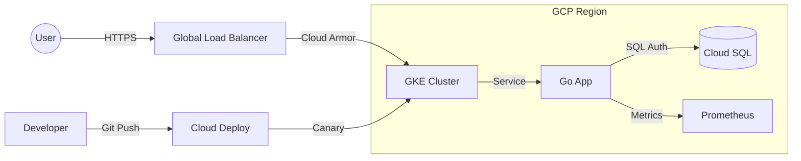
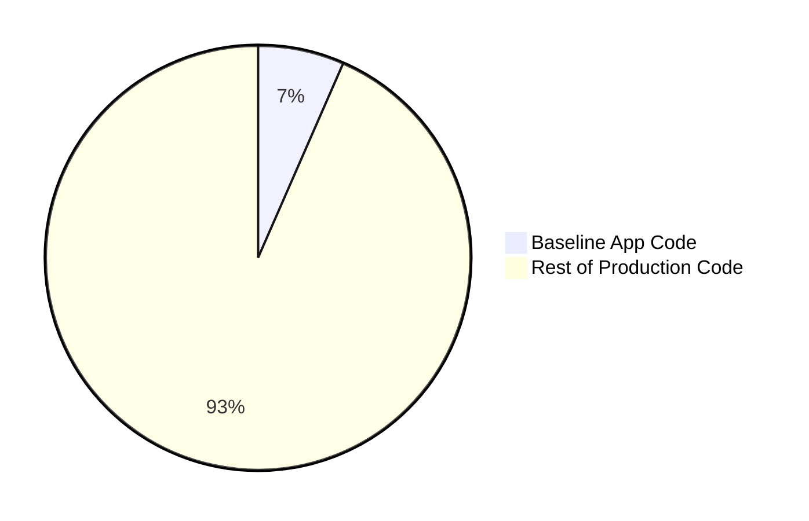
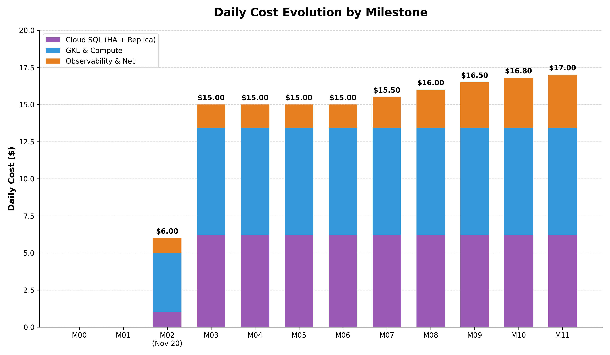

# go-to-production: A Cloud-Native Journey

> **Note:** This repository focuses on the wrapper, not the candy. The application code is deliberately minimal to highlight the **Infrastructure, Security, and Observability** layers required for production.

## Purpose

This repository serves as a reference implementation for modern cloud-native practices on Google Cloud Platform (GCP). It evolves from a simple local Docker setup to a highly available, secure, and observable system running on GKE.

## How It Works: Time Travel

Don't just see the finish line—see the journey. This repo uses **Git Tags** to let you step through the evolution of a service.

1.  **List all tags:**
    ```bash
    git tag -l
    ```
2.  **Checkout a specific milestone:**
    ```bash
    git checkout tags/milestone-02-base-infra
    ```
    *See the code exactly as it was when we first added Kubernetes.*
3.  **Return to the latest version:**
    ```bash
    git checkout main
    ```

## Architecture: The Final State

This is what you will have built by the end of the journey:



## Key Insights: The Iceberg

Transforming a "minimum viable system" into a production-ready system requires a significant investment in infrastructure and documentation.

*   **Infrastructure > Code**: For every 1 line of application code, we wrote **2 lines of Infrastructure as Code** and **3.5 lines of Documentation**.
*   **Hidden Complexity**: IaC grew by **25x** from start to finish. (See [Full Analysis](docs/REPO_ANALYSIS.md))




## Quick Start

1.  **Run Locally (No Cloud):**
    If you just want to run the app on your machine:
    ```bash
    git checkout tags/milestone-00-baseline
    cd app
    docker-compose up
    ```
    See [Milestone 0 Docs](docs/00_BASELINE.md) for details.

2.  **Explore the "Finished" Production State:**
    The `main` branch contains the full cloud-native implementation.
    *   **IaC**: Check `terraform/` to see how GKE, SQL, and IAM are provisioned.
    *   **K8s**: Check `k8s/` for manifests including HPA, Ingress, and Monitoring.
    *   **CI/CD**: Check `clouddeploy.yaml` and `.github/workflows`.

## Milestones

| Milestone | Tag | Description |
| :--- | :--- | :--- |
| **0. Baseline** | `milestone-00-baseline` | Simple Go app + Docker Compose. [Docs](docs/00_BASELINE.md) |
| **1. Risk Analysis** | `milestone-01-risk-analysis` | Risk mitigation & implementation plans. [Docs](docs/01_RISK_ANALYSIS.md) |
| **2. Base Infra** | `milestone-02-base-infra` | GKE, Cloud SQL, CI/CD pipeline. [Docs](docs/02_BASE_INFRASTRUCTURE.md) |
| **3. HA & Scale** | `milestone-03-ha-scale` | Regional GKE, HA Cloud SQL, HPA. [Docs](docs/03_HA_SCALABILITY.md) |
| **4. IAM Auth** | `milestone-04-iam-auth` | Workload Identity, Cloud SQL IAM Auth. [Docs](docs/04_IAM_AUTH_AND_SECRETS.md) |
| **5. Security** | `milestone-05-security-hardening` | Cloud Armor WAF, HTTPS, CSP. [Docs](docs/05_SECURITY_HARDENING.md) |
| **6. Advanced Deploy** | `milestone-06-advanced-deployment` | Cloud Deploy, Canary releases. [Docs](docs/06_ADVANCED_DEPLOYMENT.md) |
| **7. Observability** | `milestone-07-observability-metrics` | Prometheus metrics & managed collectors. [Docs](docs/07_OBSERVABILITY_METRICS.md) |
| **8. Robustness** | `milestone-08-robustness-slos` | SLIs, SLOs, and Error Budgets. [Docs](docs/08_ROBUSTNESS_SLOS.md) |
| **9. Tracing** | `milestone-09-tracing-polish` | Distributed tracing & dashboarding. [Docs](docs/09_TRACING_AND_POLISH.md) |
| **10. GitOps** | `milestone-10-gitops` | ArgoCD & automated policy enforcement. [Docs](docs/10_GITOPS_AND_AUTOMATION.md) |
| **11. Policy & Rollouts** | `milestone-11-policy-rollouts` | OPA Gatekeeper & Automated Rollbacks. [Docs](docs/11_POLICY_AND_ROLLOUTS.md) |

## Reliability & Operations

We focus heavily on Day 2 operations and reliability.

*   **[Strategy & Risks](docs/STRATEGY_AND_RISKS.md)**: Comprehensive risk assessment and mitigation plan.
*   **[Runbook](docs/RUNBOOK.md)**: Operational procedures, debugging guides, and incident response.

**Top Risks Mitigated:**
*   ✅ **Bad Deployment**: Mitigated via Canary Releases.
*   ✅ **Single Zone Failure**: Mitigated via Regional GKE & HA Cloud SQL.
*   ✅ **DDoS**: Mitigated via Cloud Armor WAF.

**Future Goals:**
*   **Automated Compliance**: Ensure zero-drift infrastructure where the running state always matches the repository (GitOps).
*   **Developer Experience**: Simplify service discovery and ownership tracking via a centralized catalog (Internal Developer Platform).

## GitHub & Repository Settings

> **Note on Branch Protection:** You may notice that the `main` branch is not protected by Pull Request requirements. In a real production environment, branch protection is mandatory. However, for this **educational reference repo**, we have left it unprotected to allow you to push milestone updates directly and follow the journey without the overhead of manual PR approvals for every step.

## Estimated Daily Costs

This project currently costs approximately **$17.00 / day** to run in its fully production-ready state. Below is the breakdown and how our milestones influenced this cost curve.

| Category | Est. Daily Cost | Details |
| :--- | :--- | :--- |
| **GKE Management** | $2.40 | Fixed cluster management fee for a regional cluster. |
| **Compute Nodes** | ~$4.80 | 6x `e2-medium` nodes (2 per zone in a 3-zone regional cluster). |
| **Networking** | ~$1.20 | Global External Load Balancer + Data Transfer. |
| **Observability** | ~$2.40 | Cloud Logging, Cloud Trace, and GKE Backup ingestion. |
| **Cloud SQL** | ~$6.20 | Regional HA Instance + Read Replica. |
| **Total** | **~$17.00** | |



> **Chart Legend:**
> *   🟣 **Cloud SQL**: Regional HA Instance + Read Replica
> *   🔵 **GKE & Compute**: Regional Cluster Fee + 6 Nodes
> *   🟠 **Observability & Net**: Logging, Tracing, Backups, Load Balancer

### Cost Inflection Points

The journey from a free hobby project to a production-ready enterprise app has clear "jumps" in cost:

1.  **$0.00 → $6.00** (Milestone 02 - Nov 20th): Initial GKE cluster and Cloud SQL provisioning. A sharp jump occurred here as we scaled the node pool from 1 to 2 nodes to provide sufficient CPU capacity for the application and its sidecars.
2.  **$6.00 → $15.00** (Milestone 03): The "High Availability Jump." We moved from a Zonal to a **Regional GKE cluster**, which introduced the $0.10/hr management fee and tripled our node count (2 nodes per zone across 3 zones). Simultaneously, we upgraded Cloud SQL to a Regional HA configuration and added a Read Replica. This was our most significant investment in uptime and fault tolerance.
3.  **$15.00 → $16.50** (Milestone 07-09): Enabled Cloud Trace and comprehensive logging. Ingested data volume adds a variable but steady cost.
4.  **$16.50 → $17.00** (Milestone 10-11): Added management overhead (ArgoCD, Gatekeeper) and the GKE Backup service fee.

## Technologies Used

*   **Backend**: Go (Gin)
*   **Database**: PostgreSQL (Cloud SQL HA)
*   **Infrastructure**: Terraform, GKE, Kustomize
*   **Observability**: Prometheus, Cloud Trace, Cloud Monitoring
*   **Security**: Workload Identity, Cloud Armor, Secret Manager

## Testing

For a detailed breakdown of the testing strategy, including unit, integration, and chaos/resilience tests, refer to **[docs/TESTING.md](docs/TESTING.md)**.
