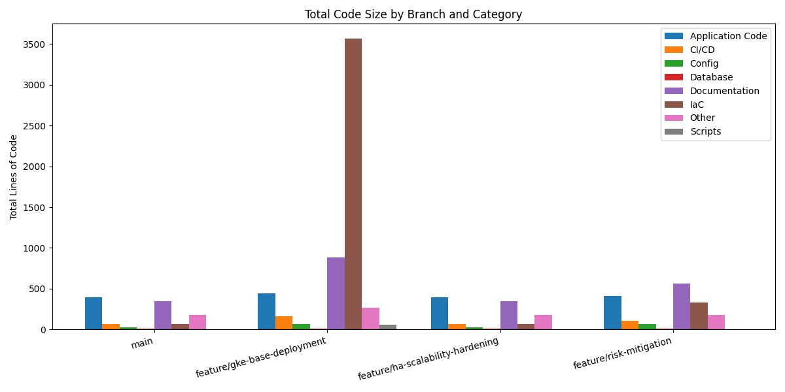

# Repository Analysis: Todo App Go

This analysis tracks the evolution of the codebase across branches, showing cumulative line counts over time.

## Methodology

- **Main Branch**: Baseline measurement of all code in the main branch
- **Branch Deltas**: Lines added/deleted in each feature branch relative to main
- **Cumulative Totals**: Total lines of code including main + branch changes

## Code Categories

- **Application Code**: Go source code, templates, and static assets
- **IaC**: Infrastructure as Code (Terraform, Kubernetes manifests, Docker)
- **CI/CD**: GitHub Actions workflows
- **Documentation**: Markdown files, README, LICENSE
- **Database**: SQL scripts and migrations
- **Scripts**: Automation and utility scripts
- **Config**: Configuration files (go.mod, .env, etc.)
- **Other**: Miscellaneous files

## Cumulative Line Counts by Branch

### Main Branch (Baseline)
| Category | Lines |
|----------|-------|
| Application Code | 392 |
| Documentation | 348 |
| Other | 178 |
| CI/CD | 69 |
| IaC | 64 |
| Config | 29 |
| Database | 9 |
| **TOTAL** | **1,089** |

### feature/gke-base-deployment
| Category | Lines | Change from Main |
|----------|-------|------------------|
| **IaC** | **3,571** | **+3,507** |
| Documentation | 880 | +532 |
| Application Code | 443 | +51 |
| Other | 263 | +85 |
| CI/CD | 161 | +92 |
| Config | 69 | +40 |
| Scripts | 56 | +56 |
| Database | 9 | 0 |
| **TOTAL** | **5,452** | **+4,363** |

**Key Changes:**
- Massive infrastructure buildout with Terraform and Kubernetes manifests
- Added comprehensive CI/CD pipeline for GKE deployment
- Database initialization scripts and documentation
- Doubled documentation with setup guides

### feature/ha-scalability-hardening
| Category | Lines | Change from Main |
|----------|-------|------------------|
| Application Code | 392 | 0 |
| Documentation | 348 | 0 |
| Other | 178 | 0 |
| CI/CD | 69 | 0 |
| IaC | 64 | 0 |
| Config | 29 | 0 |
| Database | 9 | 0 |
| **TOTAL** | **1,089** | **0** |

**Status:** No changes yet (branch exists but empty)

### feature/risk-mitigation
| Category | Lines | Change from Main |
|----------|-------|------------------|
| Documentation | 564 | +216 |
| Application Code | 412 | +20 |
| IaC | 327 | +263 |
| Other | 178 | 0 |
| CI/CD | 105 | +36 |
| Config | 67 | +38 |
| Database | 9 | 0 |
| **TOTAL** | **1,662** | **+573** |

**Key Changes:**
- Risk mitigation planning and documentation
- Additional IaC for security and monitoring
- Enhanced CI/CD with security scanning

## Visualization

The chart shows the cumulative line count distribution across all code categories for each branch.

## Summary

The repository has grown from **1,089 lines** (main) to **5,452 lines** in the GKE deployment branch, representing a **400% increase** primarily driven by infrastructure code. This reflects the transition from a simple local Docker setup to a production-ready GKE deployment with comprehensive IaC, CI/CD, and documentation.
