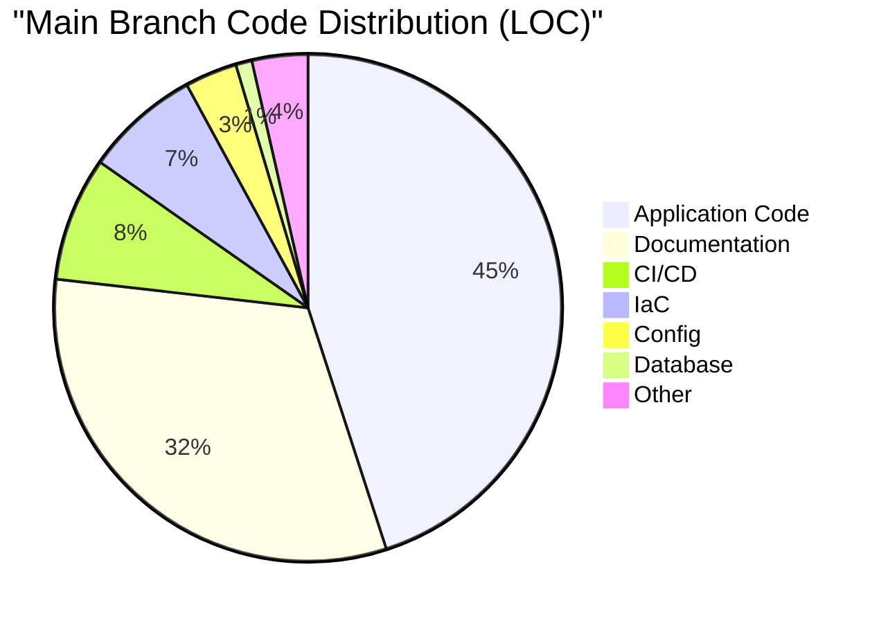

# Repository Code Analysis

This report analyzes the `todo-app-go` repository, categorizing the code by function (Application, IaC, Documentation, etc.) and comparing the `main` branch with active feature branches.

## Methodology
- **Application Code**: Go source files, HTML templates, static assets.
- **Infrastructure as Code (IaC)**: Terraform configurations, Kubernetes manifests, Dockerfiles.
- **CI/CD**: GitHub Actions workflows.
- **Documentation**: Markdown files, text documentation.
- **Config**: Configuration files (`go.mod`, `.env`, etc.).
- **Database**: SQL initialization scripts.

## Main Branch Overview

The `main` branch represents the current stable state of the application.

### Code Distribution (Lines of Code)

| Category | Lines of Code | Description |
|----------|---------------|-------------|
| **Application Code** | 392 | Core Go logic, templates, and static files. |
| **Documentation** | 277 | Project docs, plans, and guides. |
| **CI/CD** | 69 | GitHub Actions workflows. |
| **IaC** | 64 | Basic Docker and Kubernetes setup. |
| **Config** | 29 | Project configuration. |
| **Database** | 9 | SQL schemas. |
| **Other** | 31 | Miscellaneous files. |

### Visualization

## Feature Branch Analysis

This section highlights the *additional* code introduced in feature branches compared to `main`.

### feature/gke-base-deployment
This branch focuses on establishing the GKE infrastructure.

- **IaC**: +3,423 LOC. Significant addition of Terraform modules and Kubernetes manifests.
- **Documentation**: +305 LOC. Updates to deployment guides and plans.
- **CI/CD**: +78 LOC. Enhanced pipelines for GKE deployment.
- **Application Code**: +33 LOC. Minor adjustments for the new environment.

### feature/risk-mitigation
This branch addresses identified project risks.

- **IaC**: +263 LOC. Security hardening and infrastructure adjustments.
- **Documentation**: +216 LOC. Risk mitigation plans and security docs.
- **CI/CD**: +36 LOC. Security scanning and checks.
- **Application Code**: +33 LOC.

### feature/ha-scalability-hardening
*Currently has no changes relative to main.*

### Branch Comparison (Added LOC)

| Branch | IaC | Documentation | CI/CD | Application Code |
| :--- | :--- | :--- | :--- | :--- |
| **feature/gke-base-deployment** | 3423 | 305 | 78 | 33 |
| **feature/risk-mitigation** | 263 | 216 | 36 | 33 |

## Conclusion
The repository is currently heavy on **Infrastructure as Code** development, particularly in the `feature/gke-base-deployment` branch, which introduces a substantial amount of Terraform/Kubernetes configuration (over 3,000 lines). The core **Application Code** remains relatively small (~400 lines), indicating a microservice or simple utility that is being wrapped in a robust, production-grade infrastructure.
